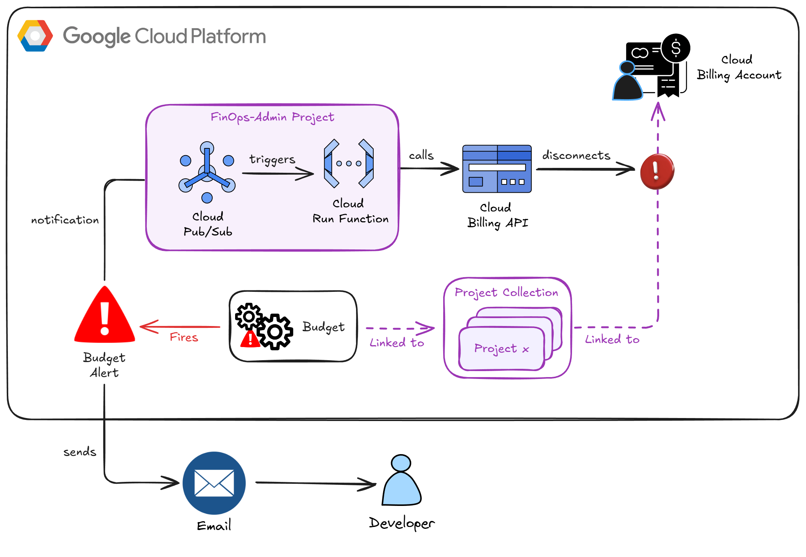

# GCP Billing Killswitch

This repo contains a reusable solution to kill billing on any projects associated with a given budget and budget alert. 
If your budget is exceeded, the resulting budget alert will cause all projects associated with that alert to be detached 
from the billing account. This immediately results in all paid resources in the project from being consumed.

The solution uses a Google Cloud Run Function (2nd Gen) triggered as a result of a Cloud Billing budget alert message, via Pub/Sub.

**⚠️ Warning: Disconnecting a project from its billing account will stop all paid services.** 

When billing is disconnected you will be able to safely investigate the root cause of your costs and take appropriate action, before re-connected billing.

## Table of Contents

- [Repo Metadata](#repo-metadata)
- [Architecture](#architecture)
- [Considerations and Options](#considerations-and-options)
- [Environment Setup](#environment-setup)
- [Project Structure](#project-structure)
- [IAM Permissions](#iam-permissions)
- [Deployment](#deployment)
  - [Every Session](#every-session)
  - [One-Time Project Setup (Per Project)](#one-time-project-setup-per-project)
  - [Deploying the Cloud Run Function](#deploying-the-cloud-run-function)
- [Useful Commands](#useful-commands)
- [Testing](#testing)
  - [Unit Testing](#unit-testing)
  - [Integration Testing](#integration-testing)
- [Useful References](#useful-references)

## Repo Metadata

Author: Darren Lester

## Architecture

This is a simple, event-driven architecture:

1.  A **Cloud Billing budget** is configured to send a notification to a Pub/Sub topic when a project's spending exceeds a defined threshold.
2.  A **Pub/Sub topic** receives the notification message.
3.  A **Cloud Run Function (2nd Gen)** is subscribed to this topic. When a message is published, the function is triggered.
4.  The function parses the incoming message to identify the associated project(s), and then uses the **Cloud Billing API** to detach the project from its billing account.
<br><br>



## Considerations and Options

- I recommend deploying the Pub/Sub topic and Cloud Run Function to a dedicated `FinOps-Admin` project. With this approach, the project(s) to be monitored are decoupled from the administration project that handles the billing detachment. But if you only plan to implement this solution for one or two projects then you can deploy the topic and Cloud Run Function directly to those projects.
- When you create your budget alerts (within Google Cloud Billing), each budget must be associated with one or more monitored projects. When the killswitch fires, it will detach ALL the projects associated with a particular budget. So you should set up budgets with appropriate granularity.

## Environment Setup

To configure your local development environment, you must first create a `.env` file and then run the provided setup script.

1.  **Create a `.env` file** in the root of the project. This file will be used by both the setup and deployment scripts. It should contain:

    ```bash
    # For gcloud authentication and project setup
    export GOOGLE_CLOUD_PROJECT="your-finops-project-id"
    export GOOGLE_CLOUD_REGION="your-region"

    # For deployment
    export FUNCTION_NAME="your-function-name"
    export BILLING_ALERT_TOPIC="your-billing-alert-topic"
    export BILLING_ACCOUNT_ID="your billing ID"
    
    # Create a budget in Cloud Billing, and obtain its ID:
    # gcloud billing budgets list --billing-account=$BILLING_ACCOUNT_ID --project=$GOOGLE_CLOUD_PROJECT
    export SAMPLE_BUDGET_ID="for-testing-a-budget"
    ```

2.  **Run the setup script:** Source the script to configure your shell environment. This will handle `gcloud` authentication, Python dependency installation, and virtual environment activation.

    ```bash
    source scripts/setup-env.sh
    ```

## Project Structure

The project is structured as follows:

```
.
├── docs
├── src
│   ├── main.py              # Cloud Run Function code
│   └── requirements.txt     # dependencies for the Function
├── tests
│   ├── budget_alert.json.template   # to create test alerts
│   └── test_main.py
├── scripts
│   └── setup-env.sh         # Local dev environment setup
├── .env
├── Makefile                 # Convenience tools
├── pyproject.toml           # Python configuration
├── TODO.md                  # Overall plan
└── README.md                # Repo overview and instructions
```

## IAM Permissions

The Cloud Function's **runtime service account** requires one of the following IAM role configurations:

1.  **On the Cloud Billing Account:**
    - `roles/billing.admin` (Billing Account Administrator)

2.  **On each target Project to be disconnected:**
    - `roles/billing.projectBillingManager` (Project Billing Manager)
    - AND `roles/resourcemanager.projectOwner` (Project Owner) or `roles/viewer` (Project Viewer)

## Deployment

Run the following commands to setup the service account, Pub/Sub topic and Cloud Run function in your specified
host project.

```bash
#####################################################
### Do these steps for any development session ######
source scripts/setup-env.sh

# ONLY if we're working with DEV project
export GOOGLE_CLOUD_PROJECT=$DEV_GOOGLE_CLOUD_PROJECT

export SERVICE_ACCOUNT_NAME="${FUNCTION_NAME}-sa"
export SERVICE_ACCOUNT_EMAIL="${SERVICE_ACCOUNT_NAME}@${GOOGLE_CLOUD_PROJECT}.iam.gserviceaccount.com"
#####################################################

# Enable APIs
gcloud services enable --project=$GOOGLE_CLOUD_PROJECT \
  artifactregistry.googleapis.com \
  cloudbuild.googleapis.com \
  pubsub.googleapis.com \
  eventarc.googleapis.com \
  cloudbilling.googleapis.com \
  cloudfunctions.googleapis.com \
  run.googleapis.com \
  logging.googleapis.com \
  billingbudgets.googleapis.com

# Create the Pub/Sub topic.
gcloud pubsub topics create $BILLING_ALERT_TOPIC --project=$GOOGLE_CLOUD_PROJECT

# Create service account if it doesn't exist
if ! gcloud iam service-accounts describe "${SERVICE_ACCOUNT_EMAIL}" --project="${GOOGLE_CLOUD_PROJECT}" &> /dev/null; then
    gcloud iam service-accounts create "${SERVICE_ACCOUNT_NAME}" \
        --display-name="Service Account for ${FUNCTION_NAME}" \
        --project="${GOOGLE_CLOUD_PROJECT}"
    echo "Service account ${SERVICE_ACCOUNT_EMAIL} created."
else
    echo "Service account ${SERVICE_ACCOUNT_EMAIL} already exists."
fi

# Service Account IAM for Billing Account
gcloud billing accounts add-iam-policy-binding "${BILLING_ACCOUNT_ID}" \
  --member="serviceAccount:${SERVICE_ACCOUNT_EMAIL}" \
  --role="roles/billing.admin" \
  --project="${GOOGLE_CLOUD_PROJECT}"

# Service Account IAM for Function-Hosting Project

gcloud projects add-iam-policy-binding $GOOGLE_CLOUD_PROJECT \
  --member="serviceAccount:$SERVICE_ACCOUNT_EMAIL" \
  --role="roles/viewer"

gcloud projects add-iam-policy-binding $GOOGLE_CLOUD_PROJECT \
  --member="serviceAccount:$SERVICE_ACCOUNT_EMAIL" \
  --role="roles/logging.logWriter"

gcloud projects add-iam-policy-binding $GOOGLE_CLOUD_PROJECT \
  --member="serviceAccount:$SERVICE_ACCOUNT_EMAIL" \
  --role="roles/run.invoker"

gcloud projects add-iam-policy-binding $GOOGLE_CLOUD_PROJECT \
  --member="serviceAccount:$SERVICE_ACCOUNT_EMAIL" \
  --role="roles/pubsub.subscriber"

# Deploy the Cloud Run Function
# Always check your SERVICE_ACCOUNT_EMAIL variable is set
gcloud functions deploy $FUNCTION_NAME \
  --gen2 \
  --runtime=python312 \
  --project="$GOOGLE_CLOUD_PROJECT" \
  --region="$GOOGLE_CLOUD_REGION" \
  --source=./src \
  --entry-point=disable_billing_for_projects \
  --trigger-topic=$BILLING_ALERT_TOPIC \
  --service-account="${SERVICE_ACCOUNT_EMAIL}" \
  --set-env-vars LOG_LEVEL=$LOG_LEVEL,SIMULATE_DEACTIVATION=$SIMULATE_DEACTIVATION 
```

### Deploying the Cloud Run Function in Simulate Mode

Note: for testing purposes, you can deploy the function in a simulation mode 
where it will log that billing *would have been disabled* without actually making the API call to detach the project from its billing account. This is controlled by the `SIMULATE_DEACTIVATION` environment variable.

### Alternative Deployment Command - Using Gcloud Run Deploy

With the evolution of Cloud Functions to Cloud Run Functions, we can now deploy using the `gcloud run deploy` command. 
It converts the function code into a Cloud Run image with the specified base image to provide our runtime.
However, this command does not create the Eventarc trigger for us, so we must create the trigger as a separate command.

```bash
export SERVICE_ACCOUNT_NAME="${FUNCTION_NAME}-sa"
export SERVICE_ACCOUNT_EMAIL="${SERVICE_ACCOUNT_NAME}@${GOOGLE_CLOUD_PROJECT}.iam.gserviceaccount.com"

# Create the Cloud Run Function
# Notes:
# - Gen1 is ideal for very small functions that frequently spin-up from 0
# - Fractional CPUs are possible with gen1, but requires concurrency to be set to 1
# - <512MB is possible with gen1
gcloud run deploy $FUNCTION_NAME \
  --base-image=python312 \
  --project=$GOOGLE_CLOUD_PROJECT \
  --region=$GOOGLE_CLOUD_REGION \
  --source=./src \
  --function=disable_billing_for_projects \
  --no-allow-unauthenticated \
  --execution-environment=gen1 \
  --cpu=0.2 \
  --memory=256Mi \
  --concurrency=1 \
  --max-instances=1 \
  --service-account="${SERVICE_ACCOUNT_EMAIL}" \
  --set-env-vars LOG_LEVEL=$LOG_LEVEL,SIMULATE_DEACTIVATION=$SIMULATE_DEACTIVATION 

# Create the Eventarc Trigger, wiring our topic to the function
gcloud eventarc triggers create ${FUNCTION_NAME}-trigger \
    --project=$GOOGLE_CLOUD_PROJECT \
    --location=$GOOGLE_CLOUD_REGION \
    --destination-run-service=$FUNCTION_NAME \
    --destination-run-region=$GOOGLE_CLOUD_REGION \
    --event-filters="type=google.cloud.pubsub.topic.v1.messagePublished" \
    --transport-topic=projects/$GOOGLE_CLOUD_PROJECT/topics/$BILLING_ALERT_TOPIC \
    --service-account=$SERVICE_ACCOUNT_EMAIL
```

## Useful Commands

| Command                       | Description                                              |
| ----------------------------- | -------------------------------------------------------- |
| `source scripts/setup-env.sh` | Setup Google Cloud project, ADC, and Python dependencies |
| `make install`                | Install all required dependencies using `uv`             |
| `make test`                   | Run unit and integration tests                           |
| `make lint`                   | Run code quality checks (codespell, ruff, mypy)          |

For full command options and usage, refer to the [Makefile](Makefile).

## Testing

### Unit Testing

After setting up your environment with the `setup-env.sh` script, you can run the unit tests:

```bash
make test
```

### Integration Testing

We can send a message that mimics a budget alert, like this:

```bash
export TEST_PROJECT_NUMBER=$(gcloud projects describe $DEV_GOOGLE_CLOUD_PROJECT --format="value(projectNumber)")

# CREATE TEST MSG by replacing placeholders in the template using values from env vars
sed "s/TEST_PROJECT_NUMBER/${TEST_PROJECT_NUMBER}/g" tests/budget_alert.json.template > tests/budget_alert.json

msg=$(cat tests/budget_alert.json)

# Ideally, create a budget alert for this test project, and store its ID in your .env
# Then publish the test message
gcloud pubsub topics publish $BILLING_ALERT_TOPIC \
    --project="$GOOGLE_CLOUD_PROJECT" \
    --message="$msg" \
    --attribute="budgetId=$SAMPLE_BUDGET_ID,billingAccountId=$BILLING_ACCOUNT_ID"
```

Now review Cloud Logging to verify the Cloud Run Function was triggered as is working as expected.

## Useful References

- [Create, edit, or delete budgets and budget alerts](https://cloud.google.com/billing/docs/how-to/budgets)
- [https://cloud.google.com/blog/products/gcp/better-cost-control-with-google-cloud-billing-programmatic-notifications](https://cloud.google.com/blog/products/gcp/better-cost-control-with-google-cloud-billing-programmatic-notifications)
- [Set up programmatic notifications](https://cloud.google.com/billing/docs/how-to/budgets-programmatic-notifications)
- [Programmatic notifications: Notification format](https://cloud.google.com/billing/docs/how-to/budgets-programmatic-notifications#notification_format)
- [Enable, disable, or change billing for a project](https://cloud.google.com/billing/docs/how-to/modify-project)
- [Disable billing usage with notifications](https://cloud.google.com/billing/docs/how-to/disable-billing-with-notifications)
- [gcloud functions deploy command](https://cloud.google.com/sdk/gcloud/reference/functions/deploy)
- [gcloud run deploy command](https://cloud.google.com/sdk/gcloud/reference/run/deploy)