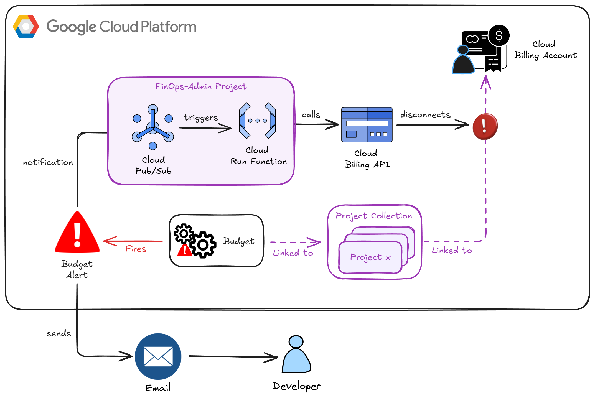

# GCP Billing Killswitch

This repository provides an automated solution to immediately disable billing for Google Cloud projects when a budget threshold is exceeded. This "killswitch" protects your account from unexpected cost spikes by detaching projects from their billing account, effectively stopping all paid services until you can safely investigate.

The solution uses a Google Cloud Run Function (2nd Gen) triggered as a result of a Cloud Billing budget alert message, via Pub/Sub.



**⚠️ Warning: Disconnecting a project from its billing account will stop all paid services.** 

When billing is disconnected you will be able to safely investigate the root cause of your costs and take appropriate action, before re-connected billing.

## Repo Metadata

- Author: Darren Lester
- GitHub Handle: derailed-dash
- Repository: https://github.com/derailed-dash/kill-project-billing

## Table of Contents

- [Key Project Documentation](#key-project-documentation)
- [Architecture & Tech Stack](#architecture--tech-stack)
- [Project Structure](#project-structure)
- [Quick Start: Working With This Repo](#quick-start-working-with-this-repo)
- [Useful Commands](#useful-commands)
- [Useful References](#useful-references)

## Key Project Documentation

| Document | Description |
| :--- | :--- |
| **[README.md](README.md)** | This file - the developer front door. |
| **[TODO.md](TODO.md)** | Project roadmap and feature backlog. |
| **[docs/architecture-and-walkthrough.md](docs/architecture-and-walkthrough.md)** | Technical blueprint, including ADRs and system overview. |
| **[docs/DESIGN.md](docs/DESIGN.md)** | Logic design and environment configuration principles. |
| **[docs/testing.md](docs/testing.md)** | Testing strategy, tooling, and command reference. |
| **[deployment/README.md](deployment/README.md)** | Infrastructure provisioning and deployment instructions. |
| **[GEMINI.md](GEMINI.md)** | Mandates and instructions for AI-assisted development. |

## Architecture & Tech Stack

The solution is an event-driven serverless function built on the following stack:

- **Hosting**: Google Cloud Run Functions (2nd Gen)
- **Messaging**: Google Cloud Pub/Sub & Eventarc
- **Language**: Python
- **APIs**: Cloud Billing API, Cloud Resource Manager API

For a detailed walkthrough, see [docs/architecture-and-walkthrough.md](docs/architecture-and-walkthrough.md).

## Project Structure

```text
kill-project-billing/
├── deployment/                # Infrastructure and deployment documentation
├── docs/                      # Technical blueprints, design, and testing docs
├── scripts/                   # Environment setup and automation scripts
├── src/                       # Cloud Run Function source code
├── tests/                     # Unit, integration, and E2E tests
├── .env.template              # Sample .env
├── Makefile                   # Developer convenience commands
├── pyproject.toml             # Python project configuration
├── README.md                  # This file
└── TODO.md                    # Project roadmap
```

## Considerations and Options

- I recommend deploying the Pub/Sub topic and Cloud Run Function to a dedicated `FinOps-Admin` project. With this approach, the project(s) to be monitored are decoupled from the administration project that handles the billing detachment. But if you only plan to implement this solution for one or two projects then you can deploy the topic and Cloud Run Function directly to those projects.
- When you create your budget alerts (within Google Cloud Billing), each budget must be associated with one or more monitored projects. When the killswitch fires, it will detach ALL the projects associated with a particular budget. So you should set up budgets with appropriate granularity.

## Quick Start: Working With This Repo

### Prerequisites

- Google Cloud SDK (`gcloud`)
- Python 3.12+
- `uv` package manager

### Environment Setup

1.  **Create a `.env` file**: Use `.env.enc` as a reference for required variables (Project ID, Region, Billing Account ID, etc.).
2.  **Initialize environment**: Run the setup script to configure `gcloud` and install Python dependencies.
    ```bash
    source scripts/setup-env.sh
    ```

### Deployment

Detailed instructions for provisioning resources and deploying the function can be found in **[deployment/README.md](deployment/README.md)**.

## Useful Commands

| Command | Description |
| :--- | :--- |
| `source scripts/setup-env.sh` | Initialize `gcloud` and local Python environment. |
| `make install` | Install all dependencies using `uv`. |
| `make test` | Run unit and integration tests. |
| `make lint` | Run quality checks (`codespell`, `ruff`, `mypy`). |

For full command options and usage, refer to the [Makefile](Makefile).

## GitHub Workflows

The repository includes several GitHub Action workflows in `.github/workflows/` for automated triage, review, and execution of plans. These are designed to support an AI-assisted development lifecycle.

- **gemini-triage.yml**: Automated issue triaging.
- **gemini-review.yml**: Automated code reviews.
- **gemini-plan-execute.yml**: Automated planning and execution of tasks.

## Useful References

- [Create, edit, or delete budgets and budget alerts](https://cloud.google.com/billing/docs/how-to/budgets)
- [Better cost control with programmatic notifications (Blog)](https://cloud.google.com/blog/products/gcp/better-cost-control-with-google-cloud-billing-programmatic-notifications)
- [Set up programmatic notifications](https://cloud.google.com/billing/docs/how-to/budgets-programmatic-notifications)
- [Programmatic notifications: Notification format](https://cloud.google.com/billing/docs/how-to/budgets-programmatic-notifications#notification_format)
- [Enable, disable, or change billing for a project](https://cloud.google.com/billing/docs/how-to/modify-project)
- [Disable billing usage with notifications](https://cloud.google.com/billing/docs/how-to/disable-billing-with-notifications)
- [gcloud functions deploy command](https://cloud.google.com/sdk/gcloud/reference/functions/deploy)
- [gcloud run deploy command](https://cloud.google.com/sdk/gcloud/reference/run/deploy)